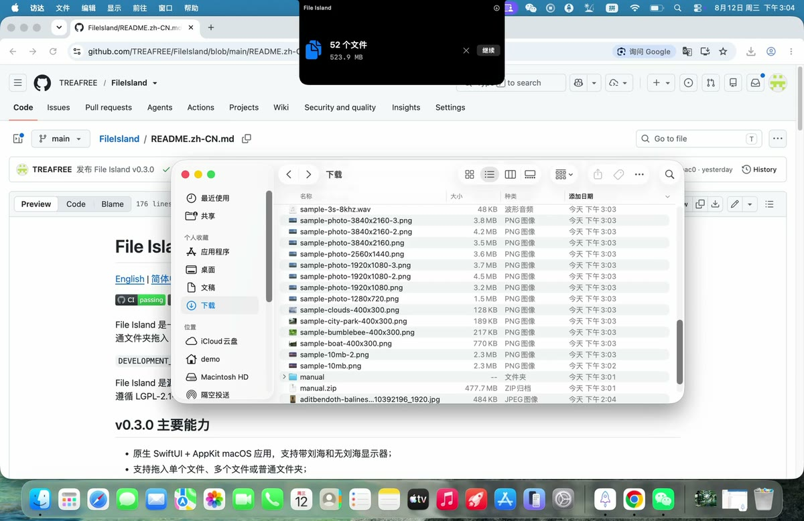
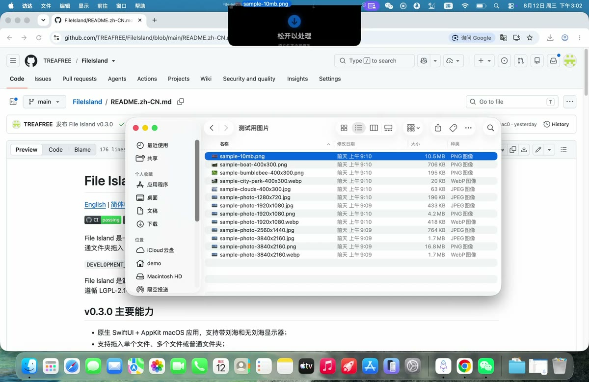
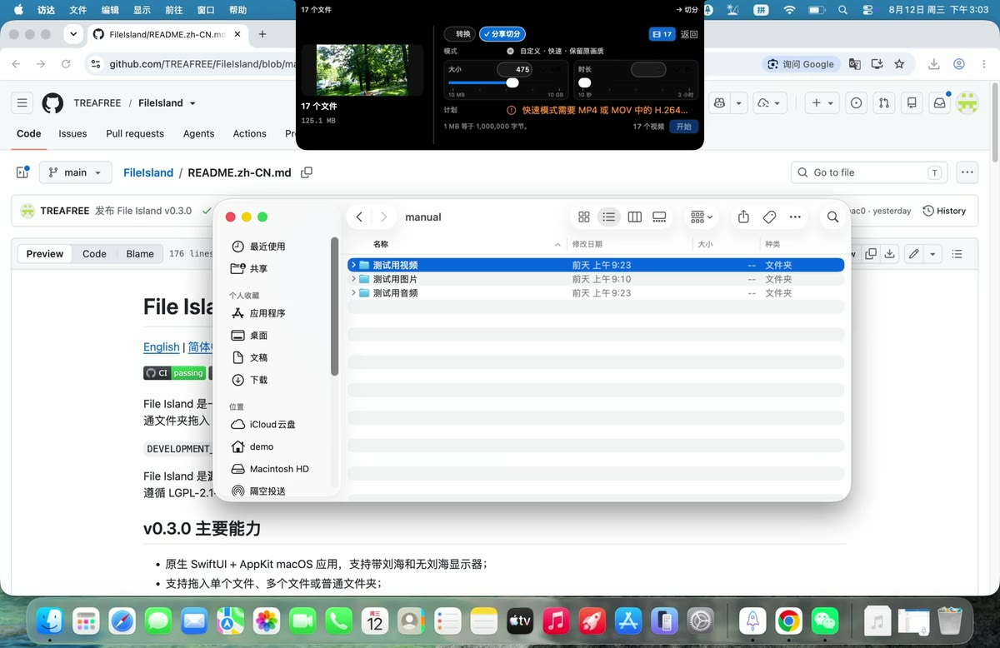
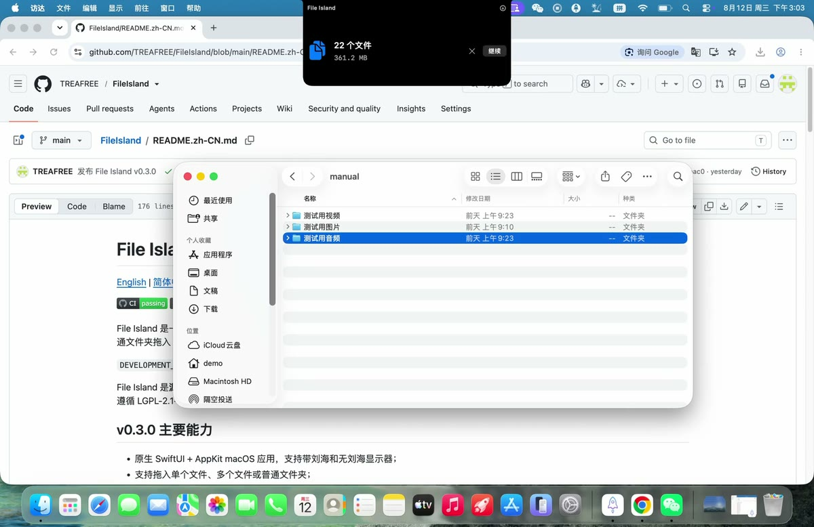
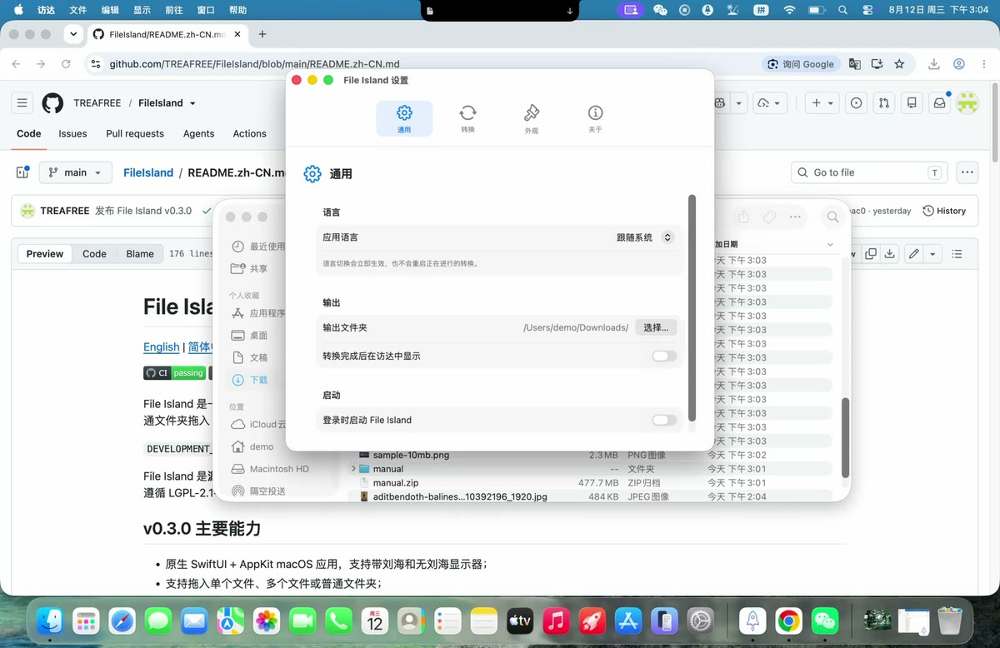

# File Island

<p align="center">
  
</p>

<p align="center">
  <strong>把图片、视频、音频和整个文件夹拖到 Mac 顶部，在本机完成转换。</strong><br>
  平时安静地藏在刘海附近，需要时展开；无需上传媒体，也无需另装 FFmpeg。
</p>

<p align="center">
  <a href="README.md">English</a> ·
  <a href="https://github.com/TREAFREE/FileIsland/releases/latest">下载最新版</a> ·
  <a href="docs/USER_GUIDE.zh-CN.md">完整教程</a> ·
  <a href="docs/FORMAT_MATRIX.zh-CN.md">格式矩阵</a>
</p>

<p align="center">
  <a href="https://github.com/TREAFREE/FileIsland/actions/workflows/ci.yml"></a>
  <a href="https://github.com/TREAFREE/FileIsland/releases/latest"></a>
  <a href="https://github.com/TREAFREE/FileIsland/releases"></a>
  
  
  
</p>

## 先看 11 秒演示

[](https://treafree.github.io/FileIsland/#mixed-folder)

> 点击封面即可在浏览器中播放。一个同时包含图片、视频和音频的文件夹，可以在同一批任务中分别选择参数并一次完成转换。

## 为什么做 File Island

成熟的商业转换套件通常功能很多，但可能采用买断或订阅；在线转换网站打开即用，却需要先上传私人媒体；FFmpeg 能力强大，但并不是每个人都愿意记命令。File Island 想提供另一种选择：保持原生 Mac 体验，把常用媒体转换放进一个低打扰、完全本地、可批处理的入口。

| 使用方式 | File Island | 在线转换网站 | 单一用途 GUI 工具 | FFmpeg 命令行 |
| --- | --- | --- | --- | --- |
| 图片、视频、音频统一入口 | ✅ | 视网站而定 | 通常专注一种媒体 | ✅ |
| 整个混合文件夹批处理 | ✅ | 通常受上传限制 | 视工具而定 | 需要编写命令/脚本 |
| 媒体留在本机 | ✅ | 通常需要上传 | ✅ | ✅ |
| Finder 拖放与可视参数 | ✅ | ✅ | ✅ | — |
| 结构化 CLI / Agent 调用 | ✅ | — | 少见 | ✅ |
| 额外运行环境 | 无，DMG 已内置运行时 | 浏览器 | 视工具而定 | 需要自行安装与维护 |

File Island 不试图替代专业剪辑软件，也不会声称支持尚未验证的格式或平台规则。遇到不安全或无法保证结果的输入时，它会停止并保留源文件。

## 主要能力

- 原生 SwiftUI + AppKit macOS 应用，自动适配有刘海与无刘海显示器；
- 拖入单个文件、多个文件或普通文件夹；
- 图片、视频和音频按类型分组，各自显示正确的输出格式与参数；
- 支持异构文件夹批处理并保留相对目录结构；
- 图片输出 JPEG/PNG，支持尺寸、质量、目标体积与元数据设置；
- 视频统一输出高兼容 H.264/AAC MP4，支持 Source、1080p、720p 与目标体积；
- 音频输出 M4A、WAV、FLAC 或 AIFF；
- 对符合条件的 H.264 MP4/MOV 按大小和/或时长快速切分，原编码流不重新压制；
- 首次授权一个输出文件夹，之后自动复用；可选单文件结果自动复制到剪贴板；源文件永不覆盖；
- 完全本地运行，无账号、广告、分析 SDK 或媒体上传；
- 内置 universal FFmpeg/ffprobe 与独立媒体校验工具，无需 Homebrew；
- 简体中文、English 和跟随系统语言；
- App 与 `fileisland` CLI 共用同一套转换核心。

完整输入/输出范围请查看[格式矩阵](docs/FORMAT_MATRIX.zh-CN.md)。

## 下载、安装与使用

1. 从 [GitHub Releases](https://github.com/TREAFREE/FileIsland/releases/latest) 下载 DMG 和对应 SHA-256；
2. 核对校验值，打开 DMG，将 **File Island.app** 拖入 **Applications（应用程序）**；
3. 从“应用程序”启动，然后把访达中的媒体或文件夹拖到屏幕顶部；
4. 分别选择图片、视频和音频参数，点击 **Start**；
5. 首次转换时选择一个固定输出文件夹，完成后在访达中查看结果。

当前 early-access 版本尚未使用 Apple Developer ID，也没有经过 Apple 公证。macOS 第一次可能会阻止启动；请先尝试打开一次，再到 **系统设置 → 隐私与安全性 → 仍要打开**。只应对来自本仓库官方 Release 且校验值匹配的安装包这样操作，不要关闭 Gatekeeper。

图文与分步骤视频见：[File Island 完整中文教程](docs/USER_GUIDE.zh-CN.md)。

## 演示

| 图片转换 | 视频转换与切分 |
| --- | --- |
| [](https://treafree.github.io/FileIsland/#image) | [](https://treafree.github.io/FileIsland/#video) |
| [▶ 播放图片演示](https://treafree.github.io/FileIsland/#image) | [▶ 播放视频演示](https://treafree.github.io/FileIsland/#video) |

| 音频转换 | 设置与语言 |
| --- | --- |
| [](https://treafree.github.io/FileIsland/#audio) | [](https://treafree.github.io/FileIsland/#settings) |
| [▶ 播放音频演示](https://treafree.github.io/FileIsland/#audio) | [▶ 播放设置演示](https://treafree.github.io/FileIsland/#settings) |

## 当前限制

- 需要 macOS 15 或更高版本；
- MP3 可输入，但当前不提供 MP3 输出；
- WebP 当前仅支持输入，不能输出 WebP；
- 快速切分仅支持 H.264 MP4/MOV，音频必须是 AAC 或不存在；
- 快速切分依赖源文件已有关键帧，不能满足限制时会安全失败；
- 暂不支持 RAW、动态图、精确重新编码切分、通用剪辑/合并或自然语言命令；
- 尚未提供经过实际验证的微信、Bilibili、Discord 等平台预设。

## 从源码构建

需要 macOS 15+、Xcode 16.4+ 与 Swift 6：

```sh
xcodebuild -project FileIsland.xcodeproj \
  -scheme FileIsland \
  -destination 'platform=macOS' \
  -derivedDataPath .build/DerivedData \
  CODE_SIGNING_ALLOWED=NO \
  build
```

```sh
xcodebuild -project FileIsland.xcodeproj \
  -scheme FileIsland \
  -destination 'platform=macOS' \
  -derivedDataPath .build/DerivedData \
  CODE_SIGNING_ALLOWED=NO \
  test
```

命令行能力、参数与自动化示例见[英文 README](README.md#command-line-interface)。

## 隐私、许可与反馈

File Island 是**源码可见软件，不是开源软件**。项目自有代码、品牌和原创素材采用 [`LICENSE`](LICENSE) 中的 All Rights Reserved 条款。内置 FFmpeg 独立遵循 LGPL-2.1-or-later。

- [用户教程](docs/USER_GUIDE.zh-CN.md)
- [格式矩阵](docs/FORMAT_MATRIX.zh-CN.md)
- [更新记录](CHANGELOG.md)
- [隐私政策](PRIVACY.md)
- [安全报告方式](SECURITY.md)
- [第三方许可声明](Legal/THIRD_PARTY_NOTICES.md)
- [FFmpeg 构建与来源记录](Legal/FFMPEG_BUILD.md)

普通问题请使用 [GitHub Issues](https://github.com/TREAFREE/FileIsland/issues)。未修复的安全漏洞请按 [`SECURITY.md`](SECURITY.md) 私密报告，不要公开上传隐私媒体。
